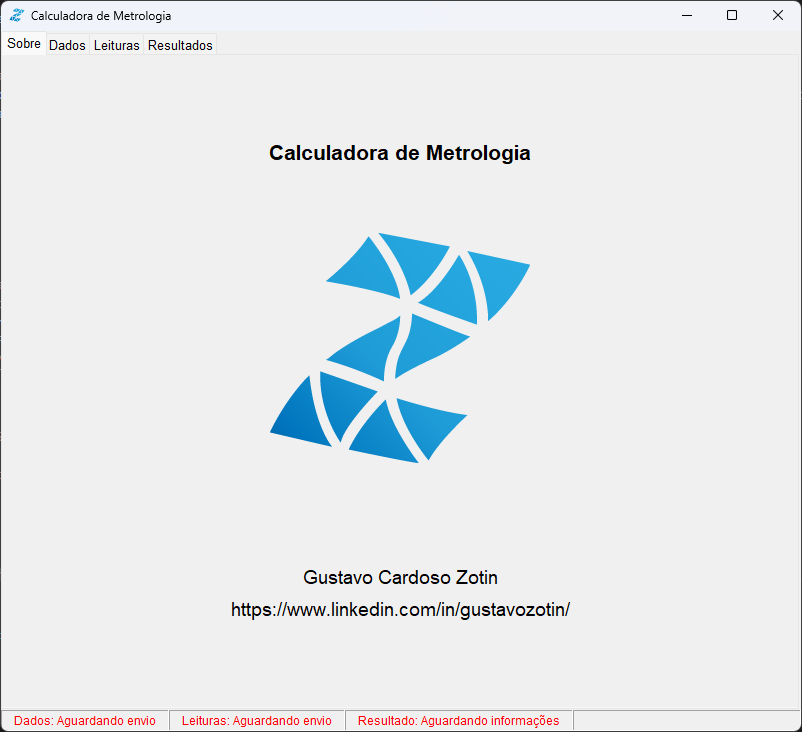
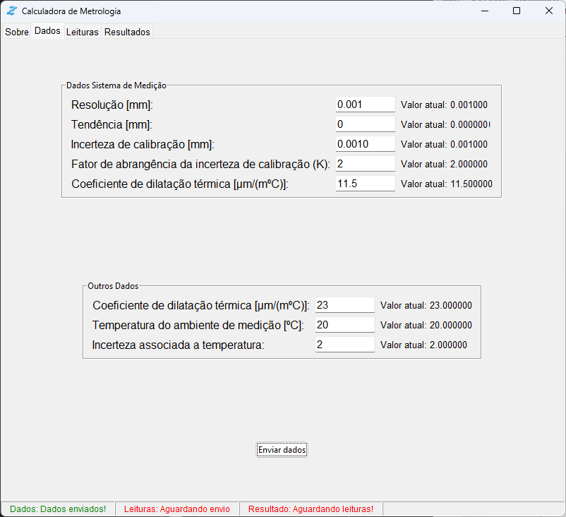
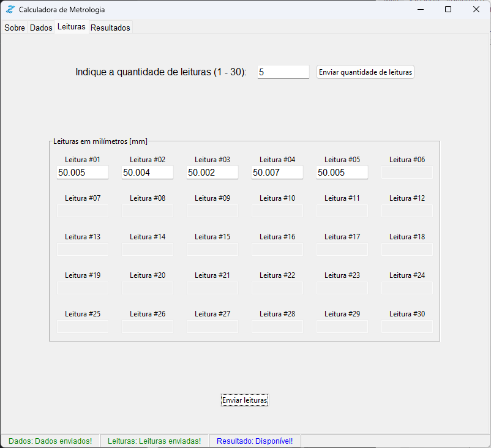
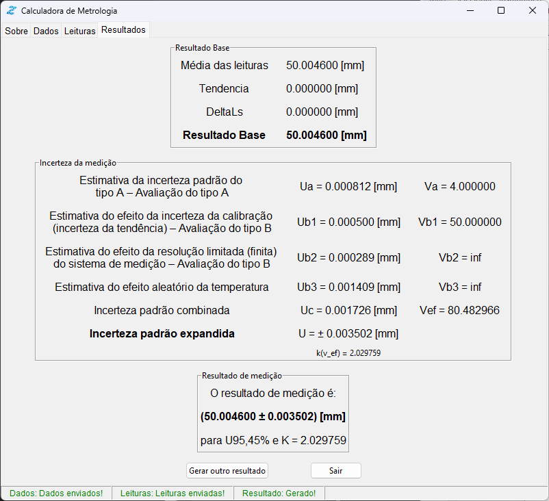

# MetrologiaPY
Programa criado com o intuito de aprender a biblioteca TKinter e aplicar os conhecimentos da matéria EME403T - METROLOGIA DIMENSIONAL do curso de Engenharia Mecânica da Universidade Federal de Itajubá.

## Programa
Dividido em 4 abas, sendo:
- Sobre (Informações sobre o programa);
- Dados (Dados do sistema de medição e objeto medido);
- Leituras (Leituras realizadas pelo equipamento de medição);
- Resultados (Resultado de medição após considerar incertezas).

## Exemplo de utilização

## Referências
- Notas de aula de EME403T - METROLOGIA DIMENSIONAL;
- CONTROLE DE EQUIPAMENTOS DE INSPEÇÃO, MEDIÇÃO E ENSAIOS: PROCEDIMENTO DE CÁLCULO DE INCERTEZA DE MEDIÇÃO EM MEDIÇÕES DIRETAS (Noronha, J. L.; Barca, L. F.)
